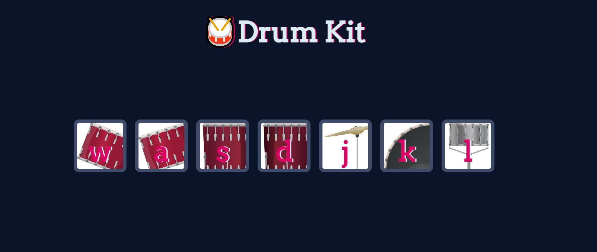

# drum-kit

A simple project that imitates the different drums sound.  
All you have to do is to to click or press the depicted keys in order to generate the sound.

  

## Technologies Used

  &nbsp;
  &nbsp;
  &nbsp;

